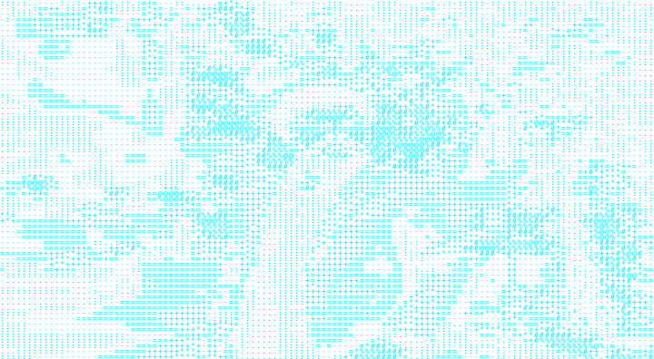

<!-- Side-by-Side Hero Header -->
<table border="0" cellspacing="0" cellpadding="0">
  <tr>
    <td align="center" valign="middle" width="300">
      
    </td>
    <td align="left" valign="middle" width="480">
      
    </td>
  </tr>
</table>

 

<!-- Snake Contribution Graph -->
### 🐍 Contribution Activity

---

### 📬 Connect with Me

  
  

